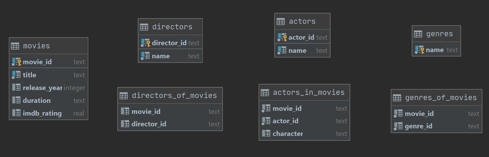

# Top rated movies database

A small collection of data about movies.

## Description

### Content of database:
This sqlite database is a collection of tables containing information about the 
[Top 250 rated movies](https://www.imdb.com/chart/top/) on IMDb at the time of
this file's last commit. It contains tables for:
* __movies__ - identified by the unique imdb id called movie_id
* __actors__ - identified by the unique imdb id called actor_id
* __directors__ - identified by the unique imdb id called director_id
* __genres__ - identified by the name of each genre

To link the movies with all the other tables, 3 more record tables are used:
* __actors_in_movies__ - links an actor with the movie in which he played
* __directors_of_movies__ - links a director with the movie he contributed to
* __genres_of_movies__ - links specific genres with the movies

### Structure of database:


### Collecting data

For gathering the data presented in this database I generated a list of the top
rated movies IMDb ids using [IMDb API](https://rapidapi.com/apidojo/api/imdb8) 
and saved it in the [top_rated_movies](top_rated_movies.txt) file.

Then, using the [other IMDb API](https://rapidapi.com/hmerritt/api/imdb-internet-movie-database-unofficial),
(which is free :smile:) I gathered data about the movies and the actors that play in them.

For genres and directors I scraped the information directly from the IMDb website.

# Usage
You can still add data to this database by running the main.py script, but before
that, you need to provide somehow a list of imdb ids of movies either by modifying
the __*getTopRatedIds*__ method in the __imdbAPI.py__ script or by writing __your
own__ method inside this script and calling it from main instead of the first
method (the advised solution).

# Installation
This scripts are written using [python3.8](https://www.python.org/downloads/)
(you can pick the most up to date version of python3). Also you need to install
this modules: 
* [requests](https://requests.readthedocs.io/en/master/)  
* [beautifulsoup4](https://www.crummy.com/software/BeautifulSoup/bs4/doc/)

__You can install them by opening a terminal and running this command__:
```
pip install requests beautifulsoup4
```

# Contributing
I am open to contributions, if you want to add information to this database,
please feel free to make a pull request.

# License
This project is licensed under [MIT](https://choosealicense.com/licenses/mit/).


